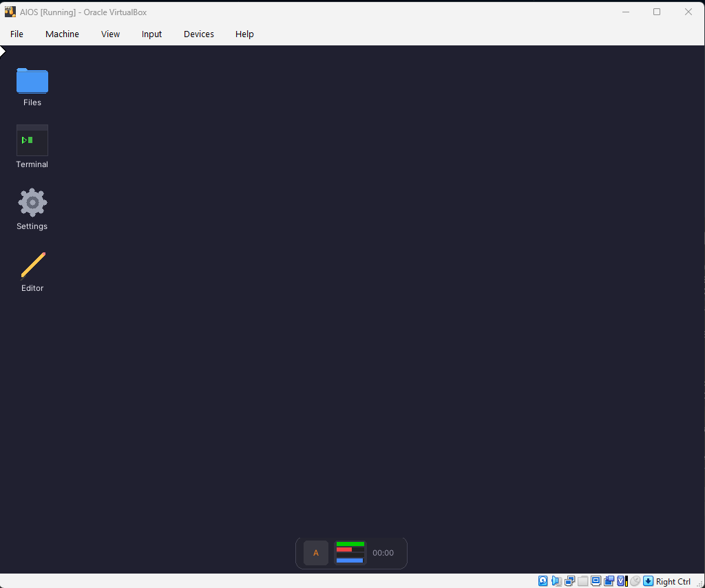
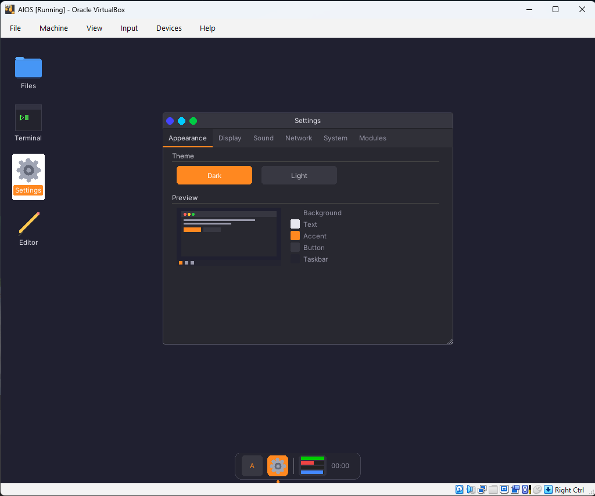
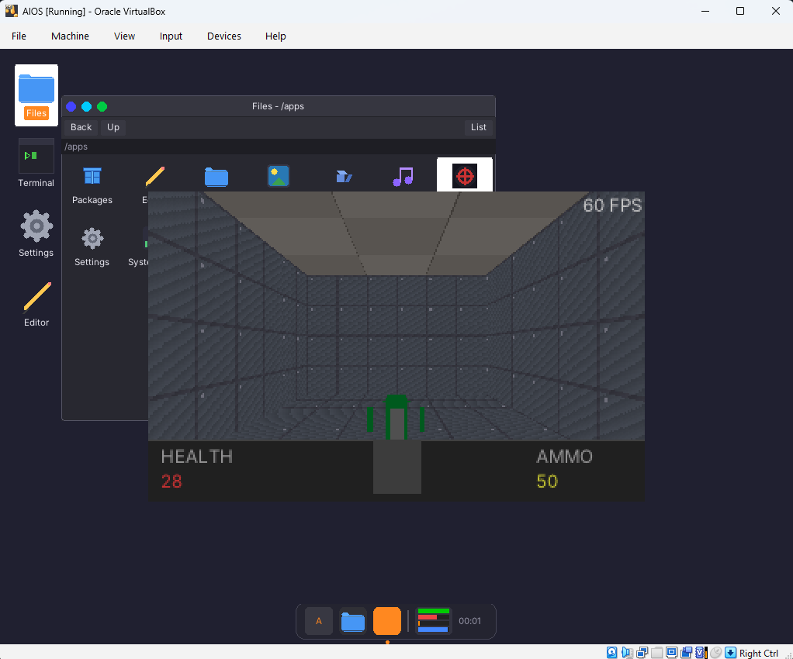

# AIOS v2

A hobby operating system targeting i686 (32-bit x86), built from scratch with a graphical desktop, Lua scripting, modular kernel drivers, and a full networking stack.

Runs in QEMU and VirtualBox (UEFI boot). Everything executes in ring 0 with identity-mapped memory.

## Screenshots

| Desktop | Settings | ChaosRIP |
|---------|----------|----------|
|  |  |  |

## Features

**Kernel (Phases 0-3)**
- UEFI bootloader (x86_64 PE/COFF, GOP framebuffer, 64-to-32-bit mode transition)
- Physical memory manager (bitmap-based, next-fit)
- Virtual memory manager (4KB paging, identity-mapped)
- Kernel heap (slab allocator + buddy allocator)
- Preemptive scheduler (PIT-driven at 250Hz, 32 tasks max)
- GDT/IDT/ISR/IRQ, FPU/SSE context switching
- PS/2 keyboard and mouse drivers
- ATA disk driver with Bus Master DMA (legacy IDE) + AHCI/SATA driver
- Block cache (512-entry LRU, write-through, 2MB RAM)

**ChaosFS (Phase 4)**
- Custom extent-based filesystem at LBA 67584 (after GPT + ESP)
- 4KB blocks, inode-based, directory support
- Full POSIX-like API (open, read, write, seek, stat, mkdir, unlink)
- Block cache with O(1) hash lookup, automatic invalidation on block free

**ChaosGL (Phase 5)**
- Software 3D renderer with surface-based compositor
- Dirty-region tracking for efficient redraws
- 2D primitives, texture support, clipping
- TrueType font rendering (stb_truetype, Inter font)
- PNG/JPEG image loading (stb_image)
- SSE2 SIMD inner loops (protected by fxsave/fxrstor)

**KAOS Modules (Phase 6)**
- Runtime kernel module loading from `.kaos` ELF relocatable objects
- Symbol table with 66+ exported kernel functions
- Dependency resolution, essential flag, auto-load from `/system/modules/`

**LZ4 Compression & CPK Archives**
- LZ4 block compression engine (freestanding, ~180 lines)
- CPK (Chaos Package) archive format with optional per-file LZ4 compression
- CRC-32 integrity verification
- Lua API (`aios.cpk.*`) for opening, listing, extracting, and installing archives
- Python build tool (`cpk_pack.py`) for creating `.cpk` files from directories

**Lua 5.5 Runtime (Phase 7)**
- Embedded Lua 5.5.0 as the application scripting layer
- Custom libc shims, ChaosFS-backed `require`/`dofile`
- App-relative `require()` paths (apps can bundle private modules)
- AIOS libraries: `aios.io`, `aios.os`, `aios.input`, `aios.task`, `aios.debug`, `aios.net`, `aios.cpk`
- Block cache stats via `aios.os.cache_stats()` / `aios.os.cache_flush()`

**UI Toolkit (Phase 8)**
- 20 Lua widgets (Button, TextField, TextArea, ListView, TabView, Dialog, etc.)
- Flex and grid layout engines
- Dark/light theme support

**Window Manager & Desktop (Phases 9-10)**
- C-level shared WM registry with per-window event queues
- macOS-style window chrome (traffic light close/minimize/maximize buttons)
- Shared AppWindow module and titlebar — zero boilerplate per app
- Floating dock with app icon textures and live system stats
- Boot splash with icon parade during module loading
- 11 apps: File Browser, Terminal, Settings, Editor, Music Player, Image Viewer, 3D Viewer, System Monitor, Web Server, Package Manager, ChaosRIP
- Directory-based app packaging with `manifest.lua` metadata

**Package Manager (Phase 12)**
- CPM (Chaos Package Manager) — install, update, remove apps from remote repo
- Static GitHub Pages repository serving `.cpk` archives over HTTPS
- Lua core library (`/system/lib/cpm.lua`) with full API: refresh, install, uninstall, update, search
- GUI app with Browse/Installed/Settings tabs
- Terminal `pkg` commands for CLI package management
- Path containment enforcement, CRC-32 verification, dependency resolution
- Atomic database writes for crash safety

**ChaosRIP (Phase 13)**
- Doom/Quake-hybrid FPS running natively on AIOS
- Portal-based sector visibility culling (Build/Quake style)
- 320x200 software rendering through ChaosGL at 60 fps
- Runtime procedural model construction for sector geometry
- Sprite shader with color-key discard and UV sub-rect for sprite sheets
- Billboarded enemy sprites (8 rotation frames, 6-state AI)
- Sector-based collision, wall sliding, portal traversal
- Hitscan shotgun (7-pellet spread), pickups, locked doors, keys
- HUD with health, ammo, weapon sprite, zone name transitions
- WAV sound effects via AC97 audio subsystem
- Full level: ~35 sectors across 4 zones (hub, armory, bridge, exit)
- All assets procedurally generated during build

**Networking (Phase 11)**
- PCI bus enumeration driver
- Intel E1000 NIC driver (KAOS module) with DMA descriptor rings
- lwIP 2.2.0 TCP/IP stack (DHCP, DNS, TCP, UDP, ICMP, ARP)
- BearSSL 0.6 TLS with HMAC_DRBG PRNG and entropy collection
- Lua networking API (`aios.net.*`) with HTTP client library

## Building

Requires i686-elf cross-compiler, x86_64 MinGW GCC, NASM, Make, Python 3, and QEMU.

```bash
# Set toolchain paths
export PATH="/c/i686-elf-tools/bin:/c/msys64/usr/bin:/c/msys64/mingw64/bin:$PATH"

# Build everything (UEFI bootloader + kernel + 512MB GPT disk image + ChaosFS)
make clean && make all

# Run in QEMU (with UEFI firmware)
make run

# Or run in VirtualBox
vm.bat
```

## Terminal Commands

Open the Terminal app from the desktop dock, then:

```
help                    Show available commands
pkg refresh             Fetch package index from repo
pkg install <name>      Install a package
pkg remove <name>       Uninstall a package
pkg update [name]       Update one or all packages
pkg search <query>      Search available packages
pkg list                List installed packages
pkg info <name>         Show package details
ifconfig                Show network configuration (IP, mask, gateway, MAC)
ping <host>             DNS resolve + TCP reachability test
dns <host>              Resolve hostname to IP address
get <url>               HTTP GET request (auto-adds http:// if omitted)
ls [path]               List directory contents
cat <file>              Display file contents
cd <dir>                Change directory
mkdir <name>            Create directory
rm <path>               Remove file
mem                     Show memory usage
clear                   Clear terminal output
```

Any other input is evaluated as a Lua expression.

## App Packaging

Apps live in `harddrive/apps/<name>/` with a `manifest.lua` and entry script:

```
harddrive/apps/myapp/
  manifest.lua    -- metadata
  main.lua        -- entry point
  lib/            -- optional private modules (require-able)
```

**manifest.lua:**
```lua
return {
    name = "My App",
    version = "1.0",
    author = "AIOS",
    icon = "/system/icons/myapp_32.png",
    entry = "main.lua",
    description = "Does something useful",
}
```

Apps can also be distributed as `.cpk` archives (created with `tools/cpk_pack.py`) and installed via `aios.cpk.install()`.

## Architecture

```
EDK2 firmware -> boot/uefi_boot.c (UEFI app) -> 64-to-32 transition -> kernel/main.c
    |
    v
PMM -> VMM -> Heap -> GDT/IDT -> Scheduler -> Drivers (IDE or AHCI)
    |
    v
ChaosFS -> ChaosGL -> KAOS modules -> Lua runtime -> Desktop shell
    |
    v
PCI -> E1000 (KAOS) -> lwIP -> BearSSL -> aios.net.* -> Lua apps
```

## Disk Image Layout (GPT)

| Region | Offset | Contents |
|--------|--------|----------|
| Protective MBR | LBA 0 | GPT compatibility |
| GPT Header | LBA 1-33 | Partition table |
| ESP (FAT16) | LBA 2048-67583 | `\EFI\BOOT\BOOTX64.EFI` + `\kernel.elf` |
| ChaosFS | LBA 67584+ | Filesystem (~480MB) |

## Project Structure

```
boot/           UEFI bootloader (uefi_boot.c, transition.asm, uefi.h)
kernel/         Kernel core (PMM, VMM, heap, scheduler, interrupts)
  chaos/        ChaosFS filesystem
  compression/  LZ4 compression and CPK archive reader
  kaos/         KAOS module system
  lua/          Lua runtime integration and AIOS bindings
  net/          Networking (lwIP port, BearSSL port, Lua net API)
  audio/        Audio subsystem (WAV, MP3, MIDI)
drivers/        Hardware drivers (serial, keyboard, mouse, ATA/DMA, AHCI, PCI)
renderer/       ChaosGL software renderer, TTF fonts, compositor
modules/        KAOS module source (e1000.c, ac97.c)
include/        Shared headers (types, io, boot_info, kaos SDK)
  libc/         Libc shim headers for vendor libraries
  kaos/         KAOS module SDK headers
vendor/         Third-party (Lua 5.5, lwIP 2.2, BearSSL 0.6, stb, minimp3)
harddrive/      Files placed on ChaosFS disk image
  apps/         Packaged apps (each has manifest.lua + main.lua)
  system/       Desktop shell, WM, UI toolkit, themes, icons, fonts
    net/        Lua networking library (http.lua)
    modules/    KAOS .kaos binaries (populated at build time)
tools/          Build tools (build_disk.py, populate_fs.py, cpk_pack.py)
documents/      Design specifications for each phase
```

## License

Hobby project. Third-party components retain their original licenses:
- Lua 5.5.0: MIT License
- lwIP 2.2.0: BSD License
- BearSSL 0.6: MIT License
- stb_image, stb_truetype: MIT License
- Inter font: SIL Open Font License
- minimp3: CC0
